# Campus Event Management System - Workflows

## Overview
This document outlines the key workflows in the Campus Event Management System using sequence diagrams. The workflows cover the complete lifecycle from event registration through attendance tracking to reporting and analytics.

## Table of Contents
- [Student Registration Workflow](#student-registration-workflow)
- [Attendance Tracking Workflow](#attendance-tracking-workflow)
- [Reporting Workflow](#reporting-workflow)
- [Complete End-to-End Workflow](#complete-end-to-end-workflow)
- [Error Handling Workflows](#error-handling-workflows)

---

## Student Registration Workflow

### 📝 Event Registration Process

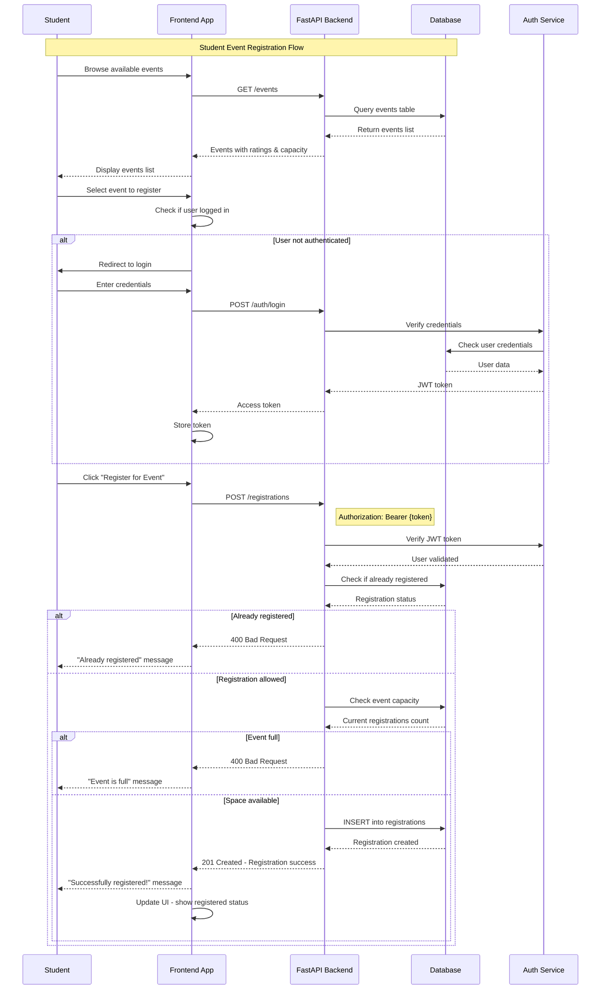

### 📋 Registration Validation Flow

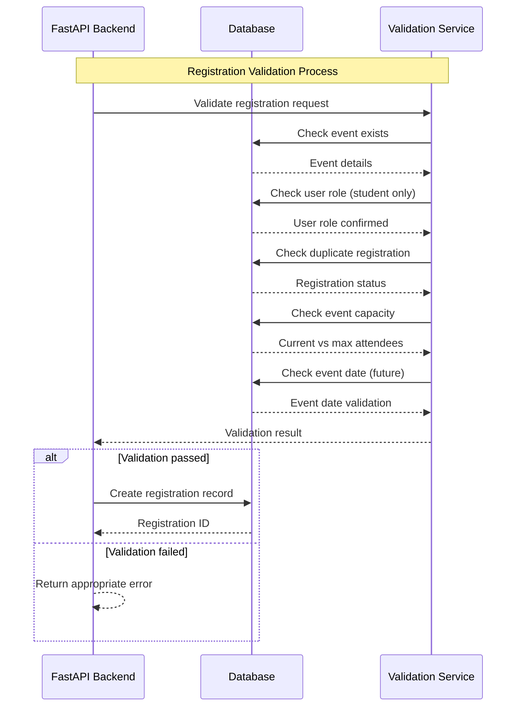

---

## Attendance Tracking Workflow

### ✅ QR Code Attendance Flow (Admin Scanning)

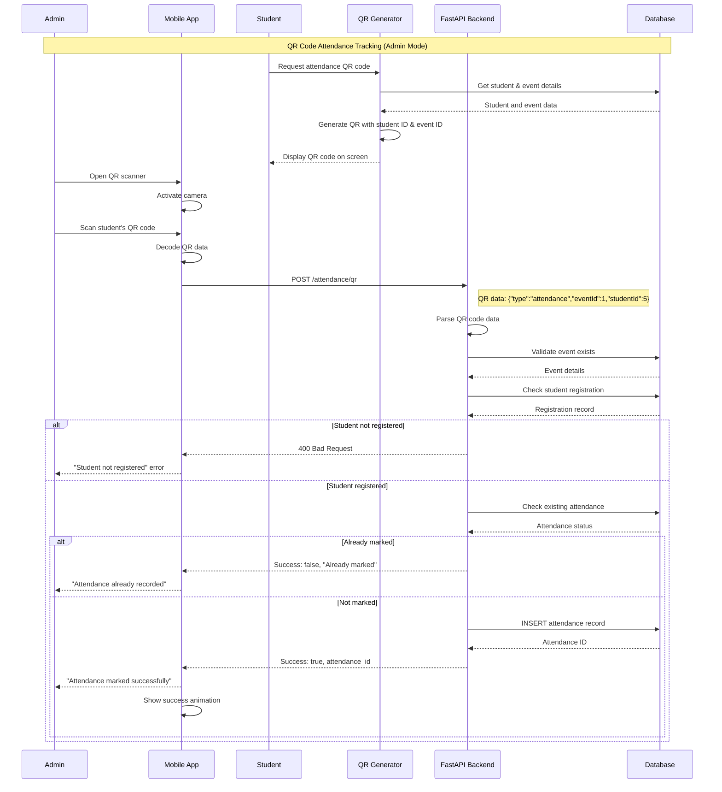

### 📱 Student Self-Attendance Flow

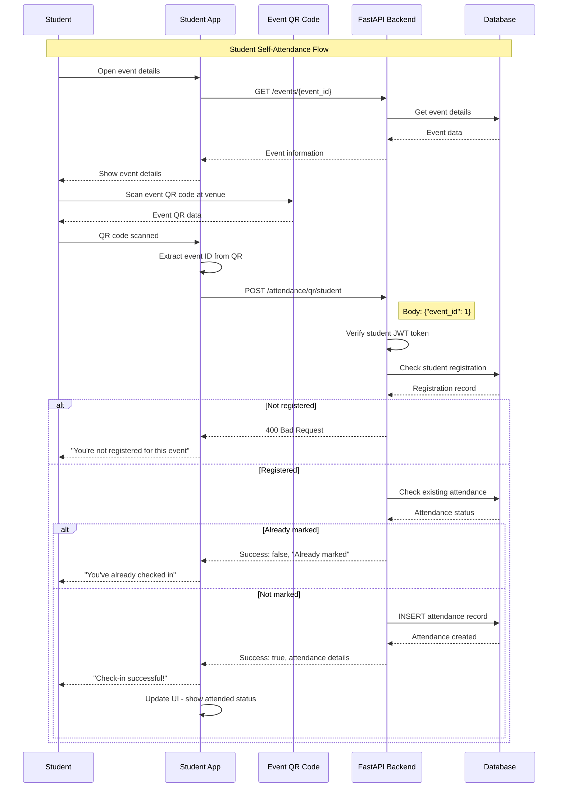

### 📊 Attendance Analytics Flow

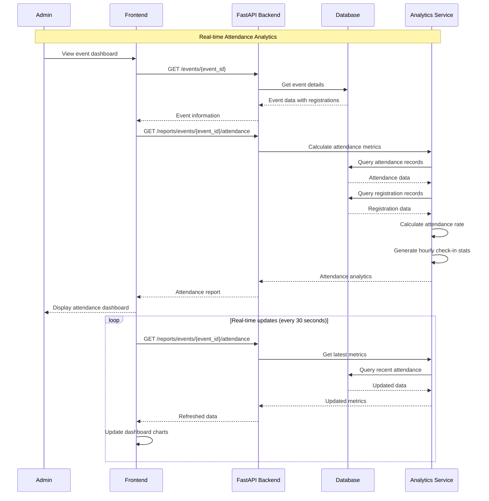

---

## Reporting Workflow

### 📈 Event Performance Report Generation

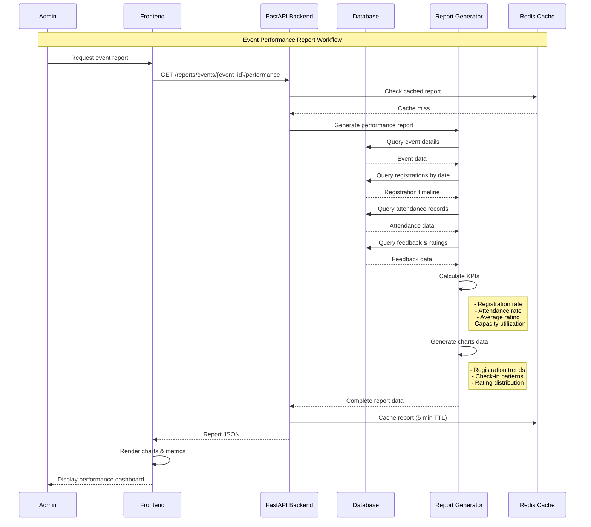

### 📊 College Analytics Workflow

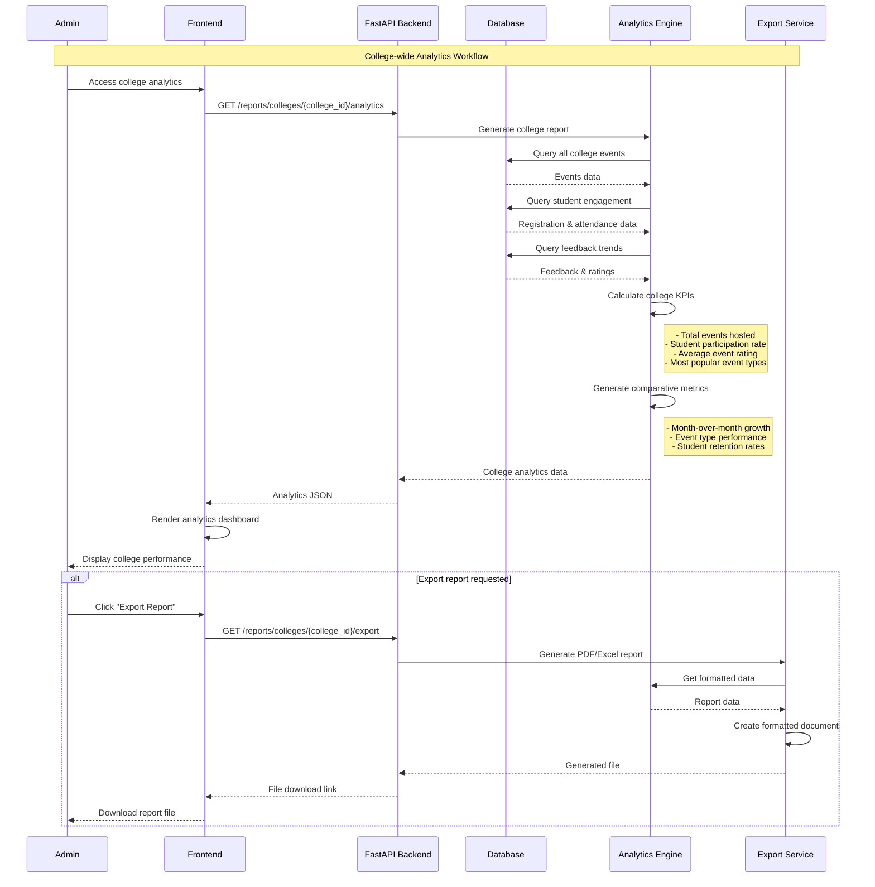

### 📋 Student Performance Tracking

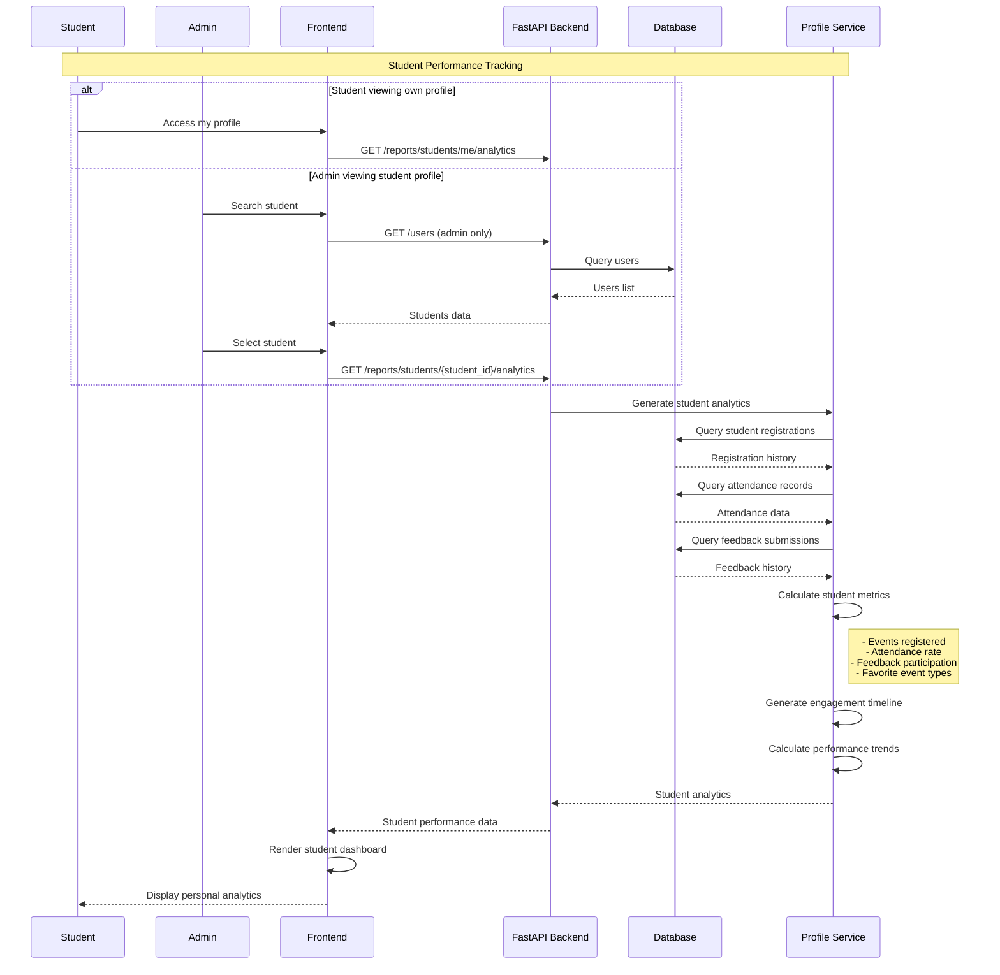

---

## Complete End-to-End Workflow

### 🔄 Full Event Lifecycle

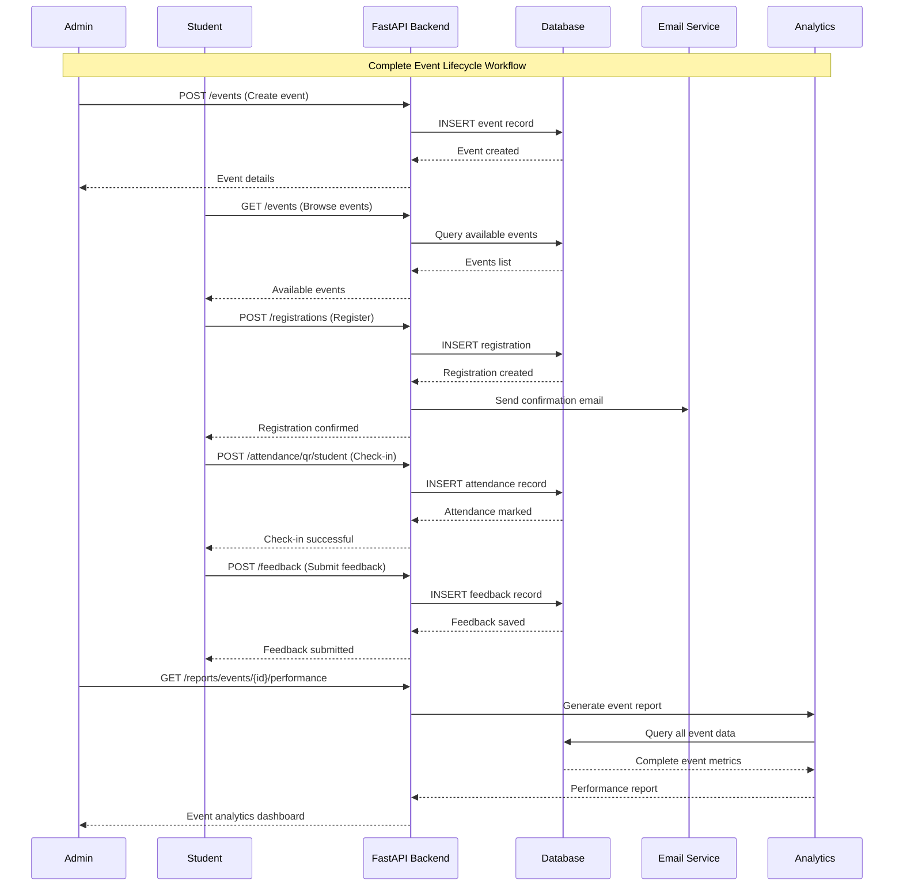

---

## Error Handling Workflows

### ⚠️ Registration Error Scenarios

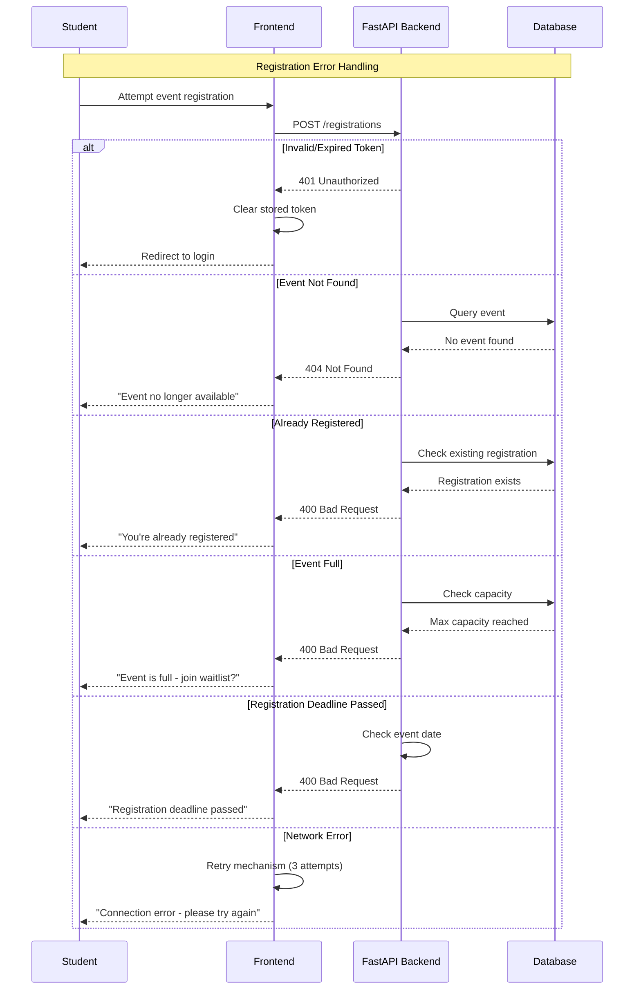

### 🚨 Attendance Error Scenarios

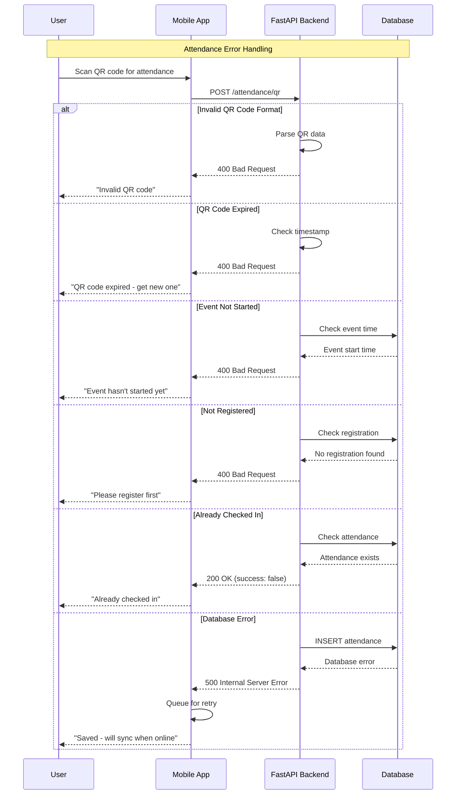

---

## Performance Considerations

### 🚀 Optimization Strategies

1. **Caching Layer**
   - Redis cache for frequent queries
   - Event details cached for 5 minutes
   - Analytics reports cached for 15 minutes

2. **Database Optimization**
   - Indexed foreign keys for fast joins
   - Pagination for large result sets
   - Connection pooling for concurrent requests

3. **Real-time Updates**
   - WebSocket connections for live attendance
   - Server-sent events for dashboard updates
   - Background jobs for report generation

4. **Mobile Optimization**
   - Offline QR code generation
   - Local storage for attendance queue
   - Progressive sync when online

---

## Security Workflows

### 🔒 Authentication & Authorization Flow

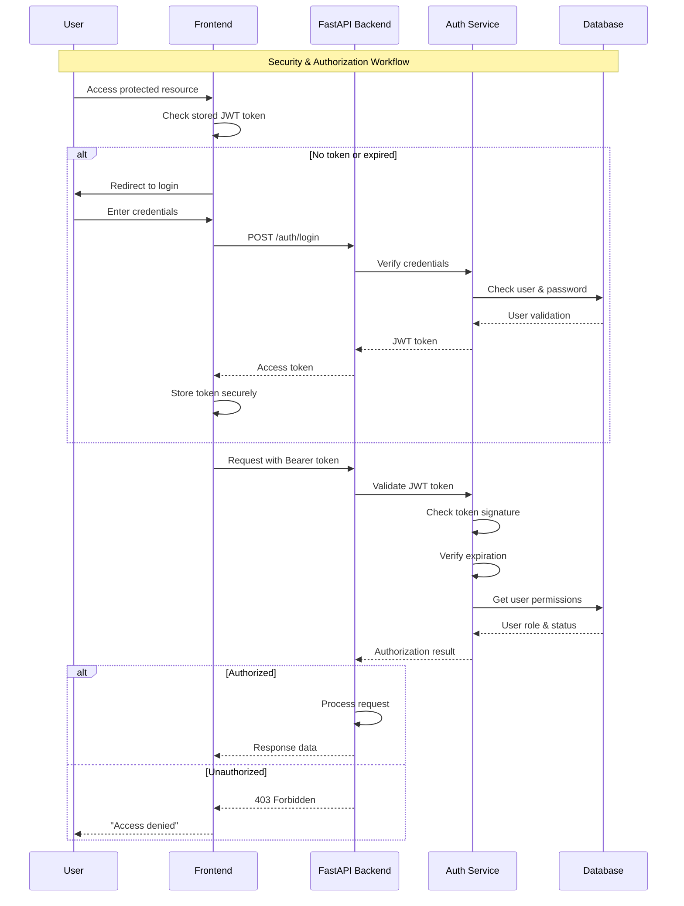
